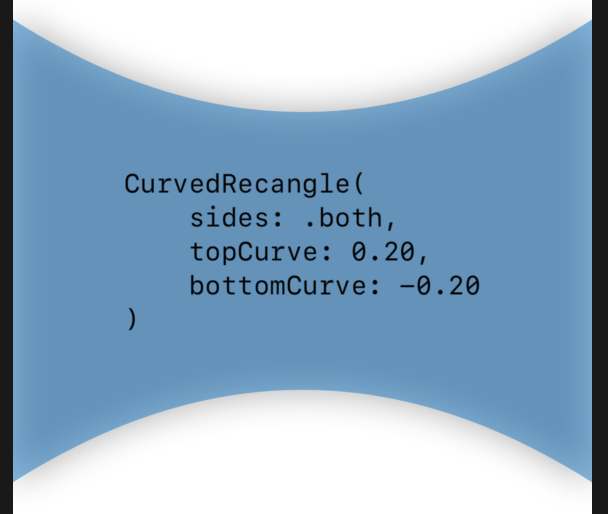

# CurvedRectangle

A SwiftUIView that creates a rectanle with a curved top, bottom or both.


### How to use

Copy the **CurvedRectangle.swift** file into your project

Create a CurvedRectangle view just as you would a Rectangle() or other native SwiftUI shapes.

There are 3 optional parameters

​	**sides**: .top, .bottom or .both

​	**topCurve**: a CGFloat between 0 and 1

​	**bottomCurve**: a CGFloat between 0 and 1

##### Top Curve Example


`````swift
CurvedRectangle {
  sites: .top,
  topCurve: 0.2
}
`````

##### Bottom Curve Example


`````swift
CurvedRectangle {
  sites: .bottom,
  topCurve: -0.2
}
`````

##### Dual Curve Example



`````swift
CurvedRectangle {
  sites: .both,
  topCurve: 0.2,
  bottomCurve: -0.2
}
`````


